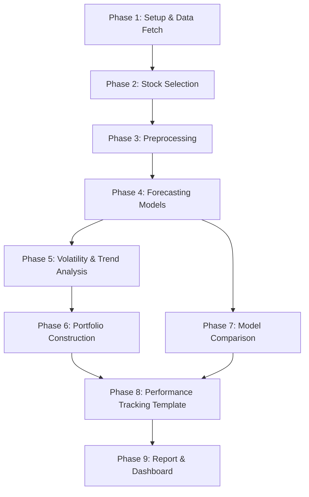

# Time Series Analysis 2026 — Capstone Project Implementation Plan

## Goal

Build a complete time series forecasting and portfolio management pipeline that:
1. Analyzes historical NSE stock data (Jan 2021 – Dec 2025)
2. Builds multiple forecasting models (ARIMA/SARIMA, Prophet, LSTM, GARCH, Exponential Smoothing)
3. Forecasts stock prices for 2 trading days ahead
4. Constructs an optimized ₹10,00,000 virtual portfolio
5. Produces a comparison framework for predicted vs actual market performance
6. Generates a professional report and optional interactive dashboard

---

## User Review Required

> [!IMPORTANT]
> **Stock Universe Selection**: The plan below proposes **10 stocks across 5 sectors**. Please confirm or adjust the stock selection before I begin coding. I'll use data-driven justification (rolling volatility, seasonal decomposition, sector momentum) but need your input on preferences.

> [!IMPORTANT]
> **Trading Day Pair**: You need to pick your 2 consecutive trading days from the StockGro window (May 11–15, 2026). Which pair do you prefer? This affects when you need to execute trades on StockGro.

> [!WARNING]
> **StockGro Registration**: You must register at the provided link and install/update the StockGro app separately. I can build all the analysis and forecasting code, but the actual trade execution on StockGro must be done manually by you.

## Open Questions

1. **Stock Preferences**: Do you have any specific NSE stocks you'd like included, or should I select purely based on data-driven criteria (liquidity, volatility profiles, sector diversity)?
2. **Model Priority**: The spec requires "at least one, preferably two or more" models. I plan to implement **4 models** (ARIMA/SARIMA, Prophet, LSTM, Exponential Smoothing) plus GARCH for volatility. Is this scope acceptable or would you like to add/remove any?
3. **Dashboard**: The optional bonus dashboard — would you like me to build an interactive web dashboard (using Plotly/Dash or a standalone HTML page), or are static matplotlib plots in the notebook sufficient?
4. **Report**: Should I generate the 10-page PDF report automatically from the notebook, or would you prefer a separate LaTeX/Word template?

---

## Proposed Changes

### Project Structure

```
d:\capstone\
├── Capstone Project TSA 2026.pdf          # Original problem statement
├── capstone_spec.txt                       # Extracted text
├── notebooks/
│   └── capstone_main.ipynb                # Main Jupyter notebook (all tasks)
├── src/
│   ├── __init__.py
│   ├── data_fetcher.py                    # yfinance data acquisition
│   ├── preprocessor.py                    # Cleaning, stationarity, scaling
│   ├── models/
│   │   ├── __init__.py
│   │   ├── arima_model.py                 # ARIMA / SARIMA
│   │   ├── prophet_model.py              # Facebook Prophet
│   │   ├── lstm_model.py                  # LSTM / GRU (PyTorch)
│   │   ├── exp_smoothing_model.py        # Holt-Winters / SES
│   │   └── garch_model.py               # GARCH(1,1) for volatility
│   ├── portfolio.py                       # Portfolio strategies (A, B, C, D)
│   ├── evaluation.py                      # MAPE, RMSE, directional accuracy
│   └── visualizations.py                 # All plotting functions
├── dashboard/                             # [OPTIONAL] Interactive dashboard
│   └── app.py                             # Plotly Dash app
├── data/                                  # Cached data files
│   └── raw/                               # Downloaded stock CSVs
├── outputs/
│   ├── forecasts/                         # Model forecast results
│   ├── figures/                           # Generated plots
│   └── report/                            # Final PDF report
├── requirements.txt                       # Dependencies
└── README.md                              # Project overview
```

---

### Phase 1: Foundation & Data Acquisition

#### [NEW] requirements.txt
- Core dependencies: `yfinance`, `pandas`, `numpy`, `matplotlib`, `seaborn`, `plotly`
- Modeling: `statsmodels` (ARIMA, Exponential Smoothing, GARCH via `arch`), `prophet`, `torch` (LSTM)
- Evaluation: `scikit-learn`
- Notebook: `jupyter`, `nbconvert`
- Dashboard (optional): `dash`

#### [NEW] src/data_fetcher.py
- Function to download daily OHLCV data from Yahoo Finance for any list of NSE tickers
- Date range: Jan 1, 2021 → Dec 31, 2025
- Cache downloaded data to `data/raw/` as CSV for reproducibility
- Add `.NS` suffix handling for NSE tickers

#### [NEW] src/preprocessor.py
- **Missing value handling**: Forward fill → backward fill → drop residual NaN
- **Stationarity testing**: ADF test per stock; auto-differencing if p-value > 0.05
- **Log returns computation**: For volatility analysis
- **Scaling**: MinMaxScaler for LSTM inputs
- **Train/test split**: Training = before July 2025, Testing = July–Dec 2025
- **Sequence creation**: Sliding window generator for LSTM input sequences

---

### Phase 2: Stock Selection (Task 1)

#### [NEW] Section in notebook — Stock Universe Selection
- **Candidate pool**: ~20 large-cap NSE stocks across 5 sectors
- **Selection criteria** (all three applied):
  1. **Rolling Standard Deviation** (30-day window): Identify stocks with interesting volatility profiles (not too flat, not too erratic)
  2. **STL Seasonal Decomposition**: Detect stocks with strong identifiable trends
  3. **Sector Momentum**: Compute 6-month sector returns, favor high-momentum sectors
- **Final selection**: ~8–12 stocks with written justification
- Proposed sectors & candidate stocks:

| Sector | Candidate Stocks |
|--------|-----------------|
| Banking | HDFCBANK.NS, ICICIBANK.NS, SBIN.NS |
| IT | TCS.NS, INFY.NS, WIPRO.NS |
| Pharma | SUNPHARMA.NS, DRREDDY.NS |
| FMCG | HINDUNILVR.NS, ITC.NS |
| Auto | TATAMOTORS.NS, MARUTI.NS |

---

### Phase 3: Forecasting Models (Task 3)

#### [NEW] src/models/arima_model.py
- Auto-ARIMA using `pmdarima.auto_arima()` or manual grid search with AIC/BIC
- SARIMA with seasonal order detection
- Residual diagnostics (Ljung-Box test, ACF/PACF of residuals)
- Forecast next 2 trading days with confidence intervals

#### [NEW] src/models/prophet_model.py
- Facebook Prophet with yearly/weekly seasonality
- Holiday effects for Indian market holidays
- Changepoint detection for regime shifts
- Forecast with uncertainty intervals

#### [NEW] src/models/lstm_model.py
- PyTorch LSTM architecture:
  - Input: sequence of 60 days of features (Close, Volume, Returns)
  - 2 LSTM layers (128 → 64 hidden units)
  - Dropout regularization
  - Dense output layer for price prediction
- Training with Adam optimizer, MSE loss
- Early stopping on validation loss
- Forecast next 2 days using recursive prediction

#### [NEW] src/models/exp_smoothing_model.py
- Holt-Winters triple exponential smoothing
- Automatic parameter selection via `statsmodels`
- Comparison of additive vs multiplicative seasonality

#### [NEW] src/models/garch_model.py
- GARCH(1,1) on log returns using `arch` library
- Conditional volatility forecasting
- Used for Task 4 (volatility analysis) and Strategy B (volatility-aware sizing)

---

### Phase 4: Volatility & Trend Analysis (Task 4)

#### [NEW] Section in notebook
- **Log returns computation** and distribution analysis
- **GARCH(1,1)** conditional volatility estimation per stock
- **Rolling standard deviation** (21-day) for each stock
- **STL Decomposition**: Trend + Seasonality + Residual for each stock
- **Trend classification**: Upward / Downward / Sideways based on trend slope
- Visualizations: volatility time series, decomposition plots, return distributions

---

### Phase 5: Portfolio Construction (Task 5)

#### [NEW] src/portfolio.py
Implement **3 strategies** (spec requires at least 2):

1. **Strategy A — Forecast-Guided Allocation**:
   - Rank stocks by predicted 2-day return
   - Higher weight to higher expected returns
   - Adjust by model confidence (prediction interval width)

2. **Strategy B — Volatility-Aware Sizing**:
   - Inverse-volatility weighting: wᵢ = (1/σ̂ᵢ) / Σ(1/σ̂ⱼ)
   - Lower allocation to more volatile stocks

3. **Strategy C — Correlation-Based Diversification**:
   - Compute pairwise correlation matrix on recent returns
   - Penalize highly correlated stock pairs
   - Optimize for low portfolio-level correlation

4. **Strategy D — Sector Momentum Rotation** (bonus):
   - Compute sector-level momentum
   - Overweight high-momentum sectors
   - Within sectors, use Strategy A or B

- **Final allocation**: Combine strategies (e.g., average of A and B, constrained by C)
- Output: allocation table with stock, amount (₹), weight (%), strategy reasoning

---

### Phase 6: Model Comparison (Task 6)

#### [NEW] src/evaluation.py
- Metrics: MAPE, RMSE, MAE, Directional Accuracy
- Per-model, per-stock evaluation table
- Ensemble comparison (simple average, weighted by inverse MAPE)
- Statistical significance testing between models
- Summary discussion template

---

### Phase 7: Performance Tracking (Task 8)

#### [NEW] Section in notebook — Predicted vs Actual Comparison
- Template for recording actual Day 1 & Day 2 closing prices from StockGro
- Automatic computation of:
  - Prediction error per stock (MAPE, absolute % error)
  - Directional accuracy (up/down prediction correctness)
  - Portfolio total return vs predicted return
  - Per-stock contribution analysis
- Reflection framework with guided questions

---

### Phase 8: Report & Dashboard

#### [NEW] outputs/report/ — Final Report
- Auto-generated from notebook sections using nbconvert or manual compilation
- 10-page PDF covering all 8 tasks
- Professional formatting with charts and tables

#### [NEW] [OPTIONAL] dashboard/app.py
- Interactive Plotly Dash dashboard with:
  - Forecast plots (actual vs predicted per stock)
  - Portfolio allocation pie chart
  - Correlation heatmap
  - Volatility & trend graphs
  - Model comparison radar chart

---

### Phase 9: Visualizations

#### [NEW] src/visualizations.py
- **Forecast plots**: Actual vs predicted with confidence bands
- **Portfolio allocation**: Pie chart by stock, grouped bar by sector
- **Correlation heatmap**: Seaborn heatmap of stock returns
- **Volatility charts**: GARCH conditional volatility over time
- **Decomposition plots**: Trend/Seasonal/Residual per stock
- **Model comparison**: Bar charts of MAPE/RMSE across models
- **Return distribution**: Histograms and QQ-plots of log returns
- All plots styled with a consistent professional theme (dark mode optional)

---

## Execution Order



## Verification Plan

### Automated Tests
- **Data integrity**: Verify no NaN in preprocessed data, correct date ranges, proper train/test split
- **Model sanity**: Ensure MAPE < 50% on test set (reasonable for stock data), residuals are approximately white noise for ARIMA
- **Portfolio constraints**: Verify weights sum to 1.0, total allocation = ₹10,00,000
- **Code execution**: Full notebook runs end-to-end without errors via `jupyter nbconvert --execute`

### Manual Verification
- User reviews stock selection rationale
- User executes trades on StockGro during the trading window
- User fills in actual Day 1/Day 2 prices after trading
- User reviews final report before submission

---

## Dependencies to Install

```
yfinance>=0.2.0
pandas>=2.0
numpy>=1.24
matplotlib>=3.7
seaborn>=0.12
plotly>=5.15
statsmodels>=0.14
arch>=6.0
prophet>=1.1
torch>=2.0
scikit-learn>=1.3
pmdarima>=2.0
jupyter
nbconvert
dash  # optional, for dashboard
```

## Timeline Alignment

| Date | Action |
|------|--------|
| May 8 (Today) | Build complete pipeline (Tasks 1–6) |
| May 9–10 | Finalize forecasts, prepare portfolio allocation |
| May 11–15 | Execute on StockGro (pick your 2-day window) |
| May 15–17 | Record actuals, complete Task 8, finalize report |
| May 17 EOD | Submit |
